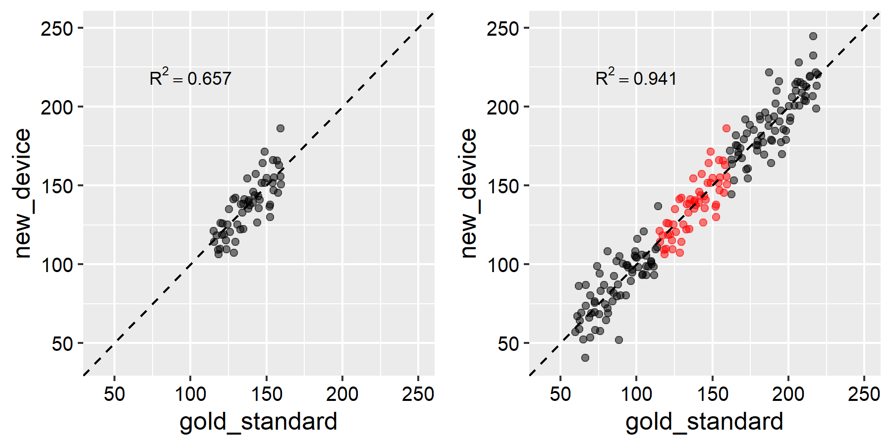
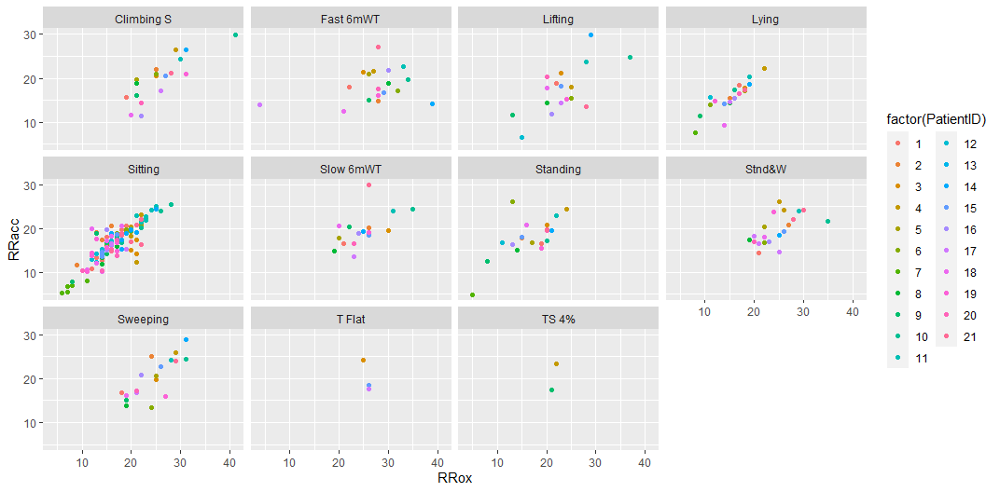

# rmba

### Repeated-measure Bland-Altman analysis with mixed models

**To-do**:   
 * ~~Implement bootstrap confidence intervals to get confidence intervals~~
     * Figure out if this bootstrapping implementation is correct!

## Introduction

Let's say you want to validate a new wearable heart rate monitor. You might get some subjects, outfit them with the new heart rate monitor and a "gold standard" device (like an ECG-based heart rate monitor). Then, you could have your subjects run on a treadmill at different speeds and inclines, measuring their heart rate using both the research-grade device and the new device.

Now, how do you determine whether the new device is accurate? One extremely common approach is to make a scatterplot and compute an R<sup>2</sup> value. Unfortunately, this approach is flawed, for two reasons.

**First**, scatter plots can be deeply misleading. Collecting a wider or a narrower range of data can make the correllation plot look artificially "good" or "bad." Observe:



The data in the left panel are just a subset of the data in the right panel. Further, the true agreement between the devices is a constant amount (because I generated the data that way!). However, **the R<sup>2</sup> values are quite different**!

On the left, the  R<sup>2</sup> value suggests poor agreement, while on the right, it suggests nearly perfect agreement.

**Second**, computing a correllation coefficient when we have multiple measurements on the same people breaks a very important statistical assumption: our data are not independent. Since we've taken *repeated measures* on the same subjects in different conditions, we have introduced dependencies into our data.

## Mixed models for measuring agreement

The usual solution to the "R<sup>2</sup> is misleading" problem is to do [Bland-Altman analysis](https://www.thelancet.com/retrieve/pii/S0140673686908378), which sounds fancy but is, in truth, far simpler to implement and interpret even than an R<sup>2</sup> value.  

However, even classic Bland-Altman analysis assumes independent observations—you can't use it when you have repeated measurements. There is a modified version that takes a repeated-measures-ANOVA-style approach, but even this tweak can't handle unbalanced or missing data, and it doesn't take into account the fact that the agreement between two devices might change in different conditions.

An elegant solution to this problem was described in a [2016 paper published by Parker et al. in PLOS ONE](https://journals.plos.org/plosone/article?id=10.1371/journal.pone.0168321). It uses linear mixed models to account for within-subject correlations, and on top of that, even accounts for variation across different conditions.  

`rmba` is my attempt to make Parker et al.'s approach simple and easy to use, by providing a wrapper to the appropriate calls to R's `nlme` package.

## Worked example

`rmba` works as follows: with `rmba.R` in your current R directory, use `source("rmba.R")` to add the function to your workspace. Below, we use data from Parker et al. to reproduce the results for comparing respiratory rate for one new device (`RRacc`) to the gold-standard device(`RRox`).

Notice that (as would be the case for plotting, or for doing any kind of regression analysis) the data are in "long" format.  

```
library(tidyverse)
library(readxl)
source("rmba.R")

df <- read_excel("Parker et al 2016 dataset.xlsx") %>%
  select(PatientID, Activity, RRox, RRacc)

df %>%
  ggplot(aes(x=RRox, y=RRacc, color = factor(PatientID))) +
  geom_point() +
  facet_wrap(~Activity)
```



The data are a bit of a mess: we have unbalanced and missing data (these were patients with COPD; many could not walk on the treadmill). Astute useRs will notice that we didn't even bother to specify `PatientID` and `Activity` as factors, yet `rmba()` will handle all of this just fine. It's still good practice to import your data correctly, of course (factors as factors, and all of that).  

## Input

```
#RRox is the gold standard measure. Compare RRacc agreement to RRox:
rmba_res <- rmba(data = df,
                 measure_one_col = "RRox",
                 measure_two_col = "RRacc",
                 condition_col = "Activity",
                 id_col = "PatientID")
```

## Output

```
[1] "Mean bias of RRacc compared to RRox: -2.183 with 95% limits of agreement [-8.631, 4.265]"
```

Programmatic useRs fear not; `rmba()` returns a `list` object with all the goodies stored inside:

```
rmba_res

$bias
[1] -2.182703

$bias_se
[1] 0.2645315

$sd
[1] 3.289795

$lower_agreement_limit
[1] -8.630582

$upper_agreement_limit
[1] 4.265176
```

The numbers above correspond exactly to the numbers in Table 1 in Parker et al. Repeating the analysis for the other devices also returns a perfect match, making me reasonbly confident that this implementation is correct.  

## Interpretation

Bland-Altman approaches are very easy to interpret. Our findings in the worked example can be summarized as follows:

> The accelerometer-based device underestimated respiratory rate by 2.18 breaths per minute. With 95% confidence, we expect the accelerometer-based device to measure respiratory rate within the range of 8.63 breaths per minute below to 4.27 breaths per minute above the true respiratory rate, during any given activity.

Parker et al. considered agreement of +/- 10 breaths per minute or less clinically acceptable, so this device was good enough for clinical use.

This method is so great because you could report these findings to a doctor or nurse with no training in statistics, and he or she could understand the results and determine whether this device fits his or her needs.

## Bootstrapping confidence intervals  

I have also implemented parametric bootstrapping to estimate confidence intervals for all of the parameters estimated by `rmba`.  

My implementation differs from Parker et al. in that I bootstrap the upper and lower limits of agreement (and everything else) directly from the bootstrap percentiles. When I was following the supplementary code to Parker et al. it wasn't completely clear to me whether their code is resampling the random effects on each boostrap replicate, which is what should be happening.  

The particular flavor of bootstrap is the "parametric random effects bootstrap coupled with residual bootstrap" detailed in [Thai et al. 2013](https://onlinelibrary.wiley.com/doi/abs/10.1002/pst.1561). The idea is to resample new random effects from a Gaussian with an SD equal to the estimated SD of the random effects, and resample new residuals similarly using the estimated SD of the residuals.

My non-expert understanding is that bootstrapping a derived variable (in this case, the limits of agreement) is just as valid as bootstrapping anything else, **but there is a good chance I am mistaken**—I am not a statistician, so this feature should be considered experimental and possibly incorrect.

Bootstrapping can be implemented as follows:

```
rmba_res_2 <- rmba(data = df,
                 measure_one_col = "RRox",
                 measure_two_col = "RRacc",
                 condition_col = "Activity",
                 id_col = "PatientID",
                 bootstrap = TRUE,
                 B = 500,
                 seed = 123)

rmba_res_2$boot_ci

           bias   bias_se       sd lower_agreement_limit upper_agreement_limit
2.5%  -2.628727 0.1743698 3.001475             -9.332041              3.588838
97.5% -1.739819 0.3410288 3.571207             -7.889312              4.948094

```

In reality, you would probably use 2000 or 10000 bootstrap replicates; 500 is just for the sake of speed here. While it's a bit silly to bootstrap the SE for the bias, it was easier to leave it in.  

## Closing notes

Hopefully you find this function useful, and maybe it will even lead to broader use of Bland-Altman analysis for validation studies in biomechanics, physiology, and wearable technology research. Drop me a line or open an issue if you find any problems with it. If you use this in research, be sure to cite both the Parker et al. paper and the `nlme()` package.

-J

## References

 * Bland, J.M. and Altman, D., 1986. Statistical methods for assessing agreement between two methods of clinical measurement. The lancet, 327(8476), pp.307-310.  
 * Parker, R.A., Weir, C.J., Rubio, N., Rabinovich, R., Pinnock, H., Hanley, J., McCloughan, L., Drost, E.M., Mantoani, L.C., MacNee, W. and McKinstry, B., 2016. Application of mixed effects limits of agreement in the presence of multiple sources of variability: Exemplar from the comparison of several devices to measure respiratory rate in COPD patients. PLOS ONE, 11(12).  
 * Thai, H.T., Mentré, F., Holford, N.H., Veyrat‐Follet, C. and Comets, E., 2013. A comparison of bootstrap approaches for estimating uncertainty of parameters in linear mixed‐effects models. Pharmaceutical statistics, 12(3), pp.129-140.
 * Pinheiro J, Bates D, DebRoy S, Sarkar D, R Core Team (2020). nlme: Linear and Nonlinear Mixed Effects Models. R package version 3.1-147
